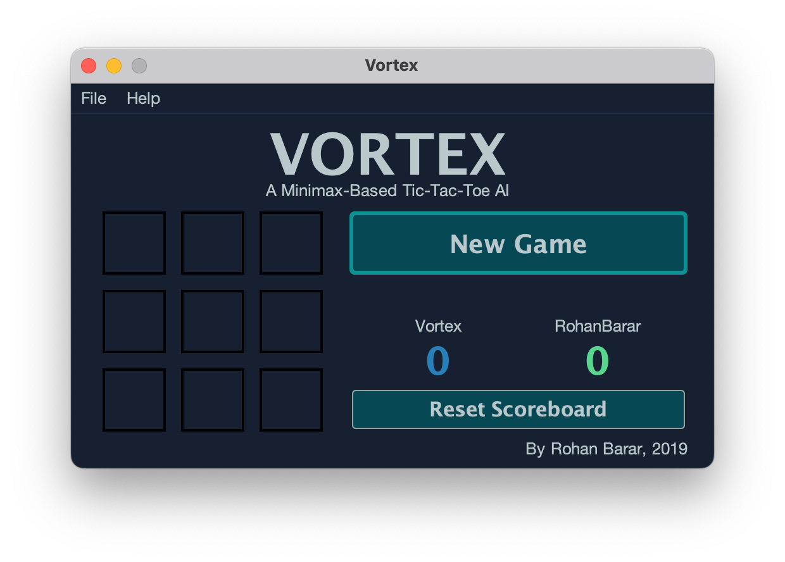
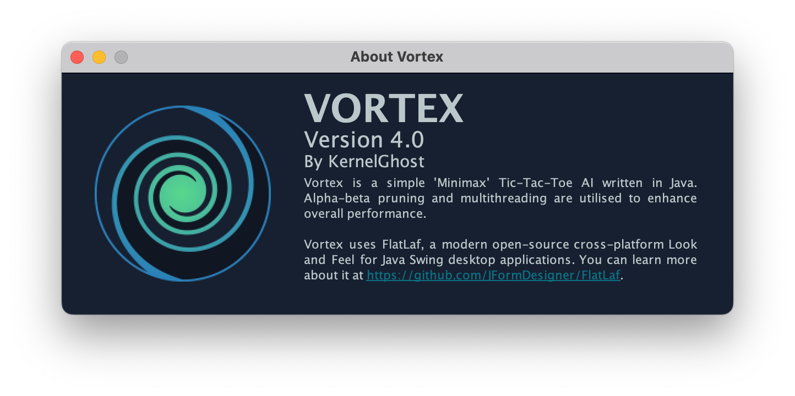

# Vortex
Vortex is a simple 'Minimax' Tic-Tac-Toe AI written in Java. Alpha-beta pruning and multithreading are utilised to enhance overall performance.

Vortex uses FlatLaf, a modern open-source cross-platform Look and Feel for Java Swing desktop applications. You can learn more about it at [https://github.com/JFormDesigner/FlatLaf](https://github.com/JFormDesigner/FlatLaf).

